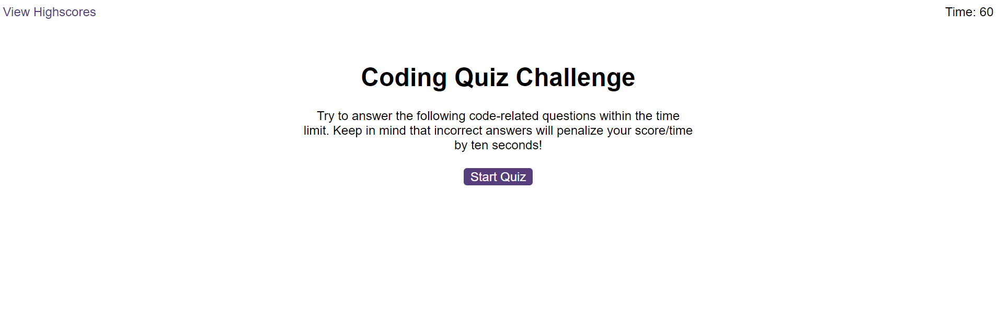
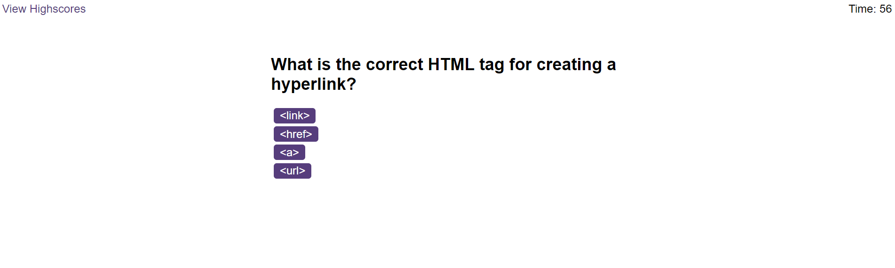
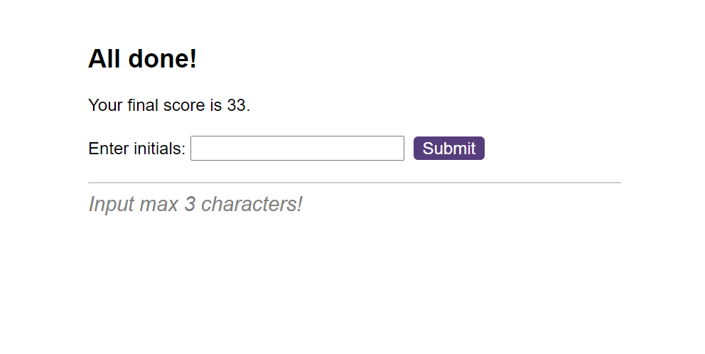
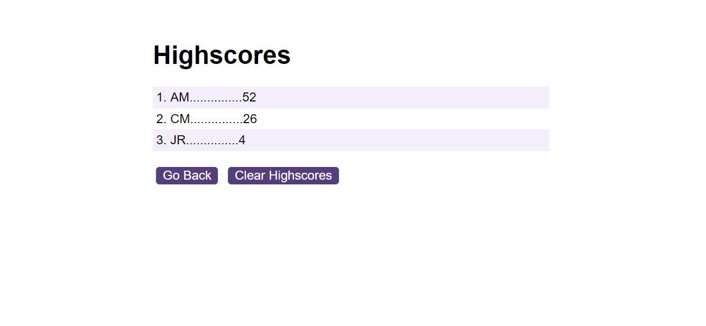

# Coding-Quiz

## Description

Dive into a thrilling JavaScript web app quiz experience! Simply hit the start button, and the timer kicks in, unveiling the first question. Navigate through a series of questions, each accompanied by answer buttons. Click wisely, as incorrect answers deduct time from your clock. Can you beat the timer and conquer all the questions? The quiz concludes with a display of your score, offering you the chance to immortalize your achievement by saving your initials and high score. Click [here](https://totes7.github.io/Coding-Quiz/) to challenge your JavaScript skills and have fun in this engaging quiz adventure!

## Usage

* Below is the starting screen, click on the 'Start Quiz' button to begin.

* Each question has 4 possible answers, only one is correct.
* Click on the answer button, if correct the next question will be displayed.
* If your answer is wrong, 10 seconds will be deducted from the timer.

* The quiz ends when you answer all 10 questions or the timer reaches 0.
* Your final score will be the time left on the timer.
* Enter your initials to record your score.

* You'll then be redirected to the Highscores page.
* Highscores are displayed in order from highest to lowest.
* Click the 'Clear Highscores' button to delete the existing highscores.

## Deployment

* The site was deployed to GitHub Pages. The steps required are as follows:
    * From the GitHub main repository, navigate to Settings page.
    * Locate the Pages section.
    * Here, select Main Branch from the drop-down menu.
    * Once selected, GitHub will generate a link to the complete website.

## Technologies Used

### Languages Used

* [HTML5](https://en.wikipedia.org/wiki/HTML5)
* [CSS3](https://en.wikipedia.org/wiki/CSS)
* [JavaScript](https://en.wikipedia.org/wiki/JavaScript)
* [Markdown](https://en.wikipedia.org/wiki/Markdown)

## Credits

The HTML and CSS code was provided by the Bootcamp Spot instructor team.

## License

N/A
